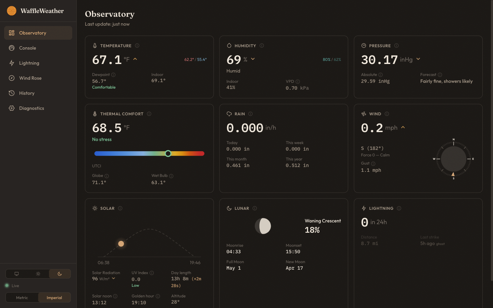
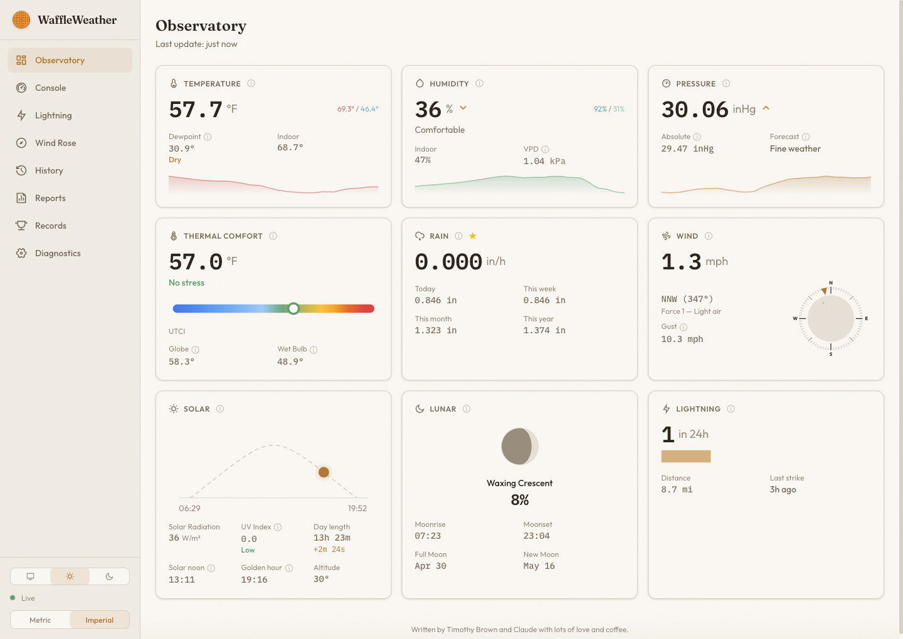
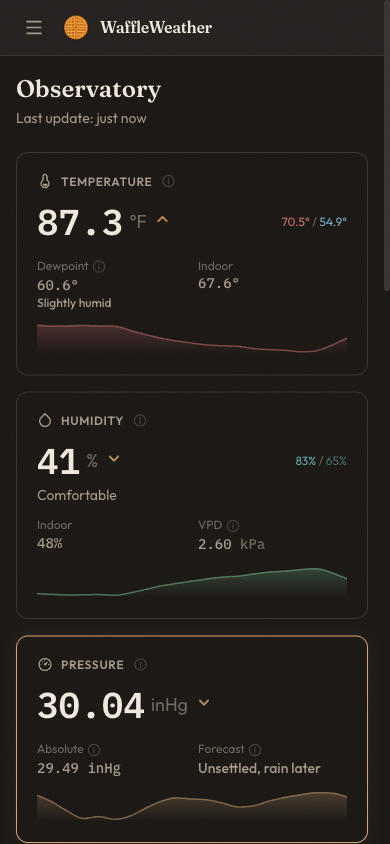
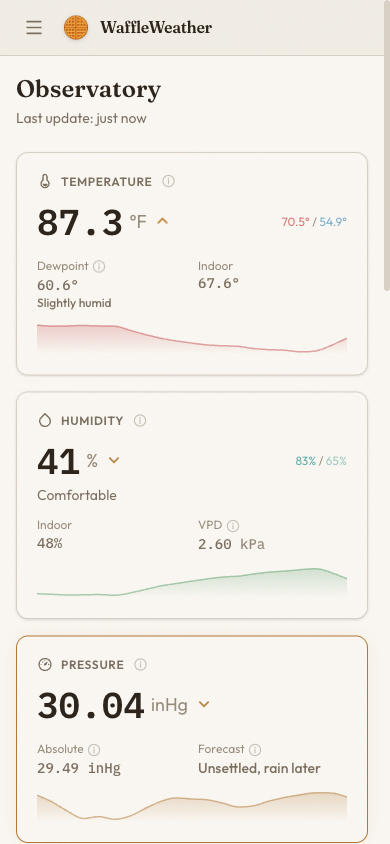
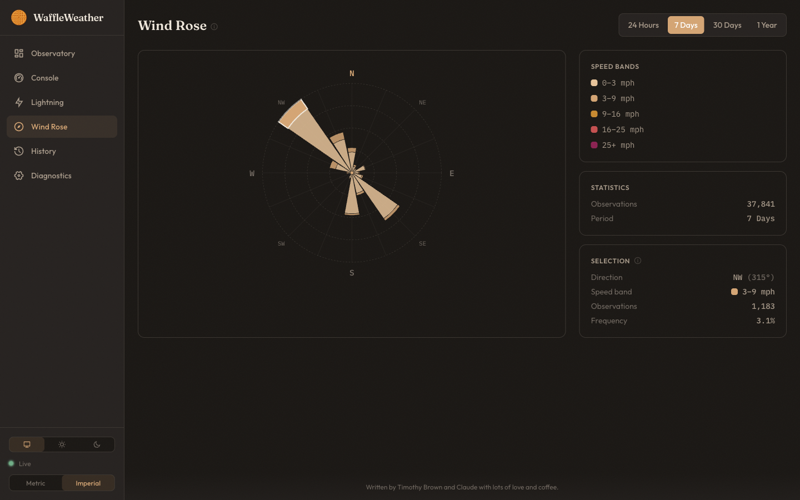
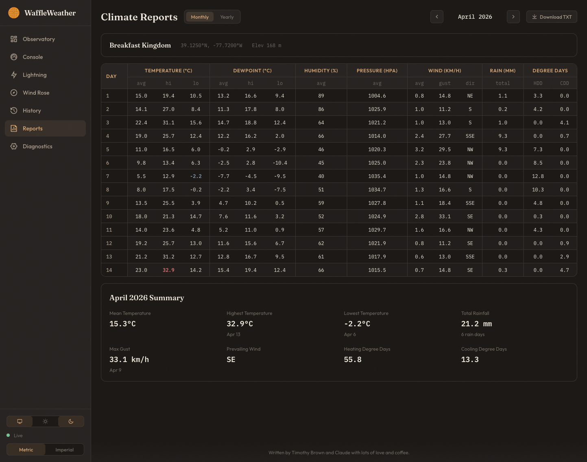

# WaffleWeather

A self-hosted weather station dashboard built for [Ecowitt](https://www.ecowitt.com/) hardware. Real-time data, historical charts, lightning tracking, wind rose visualization, and a warm design that's actually nice to look at — all running on a Raspberry Pi.

Named after a very good dog.

<table align="center">
  <tr>
    <td align="center"></td>
    <td align="center"></td>
  </tr>
  <tr>
    <td align="center"></td>
    <td align="center"></td>
  </tr>
</table>

## Why?

Ecowitt makes solid, affordable weather station hardware. But the software options for viewing your data — Ecowitt's cloud, Weather Underground, WeeWX — all have tradeoffs. Cloud services mean your data lives on someone else's server. WeeWX is powerful but shows its age in the UI and lacks real-time updates out of the box.

WaffleWeather was built to fill that gap: a modern, good-looking dashboard that runs entirely on your local network, processes data in real time, and stores everything in a proper time-series database you control.

## Features

### Observatory

The main dashboard with 9 live-updating cards in a 3-column semantic grid. Temperature (daily high/low, dewpoint, indoor), humidity (indoor, VPD), pressure (Zambretti forecast), thermal comfort (UTCI with precise MRT from BGT sensor, Globe and Wet Bulb sub-stats when a WH32 sensor is connected), rain, wind (tick ring compass with canvas particle drift animation), solar (sun arc with irradiance-responsive glow, solar radiation, UV index, day length, golden hour, altitude), lunar (moon phase and illumination), and lightning. Every value updates in real time over WebSocket with 15-minute trend arrows. Click-to-toggle info tips on every card explain what each metric means and how it's calculated.

### VFD Console

A Davis Vantage-inspired all-in-one display with an amber vacuum fluorescent aesthetic. Features a wind direction dot on a compass ring with speed centered inside, 24-hour barometric pressure dot chart, Zambretti forecast with large SVG weather icons, DSEG7 seven-segment numerics, Dotrice dot-matrix text, phosphor-glow effects, and a scrolling conditions ticker. Everything on one screen, no scrolling required.


### Lightning Tracker

Interactive Leaflet map showing your station location and strike distance rings. Below the map: current sensor stats (count, distance, time since last strike), a strike activity bar chart, and a storm distance line chart showing approach/retreat patterns. Detected events are stored in a separate hypertable so you can browse storm history in the timeline. A configurable ghost strike filter suppresses WH57 false positives — common single-strike events at fixed distances caused by EMI — flagging them rather than dropping them so raw data is preserved.


### Wind Rose

A custom SVG polar chart breaking down wind patterns by direction and speed across 16 compass sectors and 5 speed bands. Configurable time ranges from 24 hours to a full year, with statistics for dominant direction and peak gust.



### History

Time-series charts for temperature, humidity, pressure, wind, rain, and solar/UV with automatic resolution scaling — raw data for 24 hours, hourly aggregates for a week, daily for a month, monthly for a year. Synchronized crosshairs across all charts and drag-to-zoom. Hover over any chart to see precise values in the floating tooltip.


### Calendar Heatmap

A GitHub-style calendar heatmap for any metric (temperature, humidity, rain, wind, pressure, solar, lightning). Switch between metrics using the tab bar. Hover over any day to see a detailed breakdown — temperature and humidity show daily low, average, and high; other metrics show the day's value with units.


### Climate Reports

NOAA-style monthly and yearly climate summaries with daily breakdown tables showing temperature, dewpoint, humidity, pressure, wind (with prevailing direction), rainfall, and heating/cooling degree days. Browse reports in the app with a year/month picker, or download classic fixed-width NOAA-format text files for archiving and sharing.



### Install as an App

WaffleWeather is a Progressive Web App — add it to your phone's home screen for a native app experience. On iOS, tap Share → "Add to Home Screen". On Android, tap the install prompt in Chrome. You get standalone mode (no browser chrome), a waffle icon, and app shortcuts for quick access to the Observatory, Console, Lightning, and History pages. If the Pi is unreachable, an offline fallback page tells you so instead of a browser error.

### Additional Features

**Diagnostics** — Battery levels, gateway stats, firmware info, and connection status. Useful for keeping an eye on sensor health.

**Unit Toggle** — Global metric/imperial switch in the sidebar that converts everything on the fly. All data is stored as metric; conversions happen in the browser with precision tuned to sensor resolution.

**Derived Meteorology** — Dew point (Magnus-Tetens), heat index (full NWS Rothfusz), wind chill, composite feels-like, UTCI thermal comfort (precise MRT from Black Globe Temperature via ISO 7726 when available, otherwise approximated from solar radiation), and Zambretti barometric forecast (based on the [pywws implementation](https://github.com/jim-easterbrook/pywws) of the 1915 Negretti & Zambra algorithm, with 16-point wind direction table and automatic hemisphere detection from station latitude). Computed on the fly, never stored stale.

## Architecture

```
Ecowitt Station  -->  ecowitt2mqtt  -->  Mosquitto (MQTT)
                                              |
                                         FastAPI Backend
                                        /       |       \
                                   REST API   WebSocket   TimescaleDB
                                        \       |       /
                                         Nginx reverse proxy
                                              |
                                       Next.js Frontend
```

The Ecowitt gateway pushes data to [ecowitt2mqtt](https://github.com/bachya/ecowitt2mqtt) over HTTP, which normalizes it and publishes to an MQTT broker. The FastAPI backend subscribes to MQTT, stores observations in TimescaleDB, enriches them with derived calculations, and pushes updates to connected browsers over WebSocket. The Next.js frontend handles all the rendering and unit conversions.

Everything runs natively on the Pi — no Docker, no containers. A Raspberry Pi 4 with 4GB RAM handles it all comfortably.

## Tech Stack

| Layer | Technology |
|-------|-----------|
| Backend | FastAPI, Python 3.12+, SQLAlchemy async, aiomqtt, Alembic |
| Database | TimescaleDB (PostgreSQL 17) — hypertables, continuous aggregates, compression |
| Frontend | Next.js 16 (App Router), TypeScript, uPlot (Canvas charts), TanStack Query |
| API Contract | OpenAPI 3.1 YAML (hand-written, single source of truth) |
| Client Codegen | Orval — generates typed TanStack Query hooks from the OpenAPI spec |
| Real-time | WebSocket with auto-reconnect and exponential backoff |
| Styling | Tailwind CSS v4, custom "Warm Observatory" design system |
| Fonts | Fraunces (headings), Outfit (body), IBM Plex Mono (data readouts) |
| Package Managers | uv (Python), pnpm (Node) |
| Deployment | systemd services, Nginx reverse proxy, rsync from dev machine |

## Hardware Requirements

**Weather Station**: Any Ecowitt gateway with sensors. The MQTT parser handles field name variants across models, so most Ecowitt setups should work. Currently tested with:

- **Gateway**: GW3000B (GW1000, GW1100, GW2000 should also work)
- **Outdoor sensor**: WS68 (temperature, humidity, wind, solar, UV)
- **Rain gauge**: WH40H (piezo)
- **Indoor sensor**: WH32 (temperature, humidity, Black Globe Temperature, WBGT, VPD)
- **Lightning**: WH57 (AS3935 sensor)

Sensors you don't have simply won't populate those cards — the dashboard gracefully handles missing data.

**Server**: Raspberry Pi 4 (4GB RAM recommended). Should also work on a Pi 5 or any Debian-based Linux system. The full stack (PostgreSQL + TimescaleDB, Mosquitto, FastAPI, Next.js, Nginx) runs well within 4GB.

## Setup

This guide assumes you have a Raspberry Pi running Debian 13 (Bookworm or Trixie) with SSH access and your Ecowitt gateway on the same network.

### 1. Clone and run the setup script

```bash
ssh your-user@your-pi
git clone https://github.com/timothybrown/WaffleWeather.git /opt/waffleweather
cd /opt/waffleweather
bash deploy/setup.sh
```

The setup script installs and configures:
- PostgreSQL 17 + TimescaleDB (tuned for Pi 4)
- Mosquitto MQTT broker (with authentication)
- Nginx reverse proxy
- Node.js + pnpm
- uv (Python package manager)
- A `waffleweather` system user and systemd service files

It generates random passwords for the database, MQTT broker, and API key, and writes them to `/opt/waffleweather/.env`.

### 2. Configure your environment

Edit `/opt/waffleweather/.env` with your station details:

```bash
# Station identity (shown in UI and used for lightning map centering)
WW_STATION_NAME=My Weather Station
WW_STATION_LATITUDE=40.7128
WW_STATION_LONGITUDE=-74.0060
WW_STATION_ALTITUDE=10.0
```

The database URL, MQTT credentials, and API key are filled in automatically by the setup script. See `.env.example` for the full list.

### 3. Configure ecowitt2mqtt

Install [ecowitt2mqtt](https://github.com/bachya/ecowitt2mqtt) and point it at your Mosquitto broker. A systemd service file is included at `deploy/ecowitt2mqtt.service` — it reads MQTT credentials from the same `.env` file.

Then configure your Ecowitt gateway's "Customized" server to push to `http://your-pi:8080/data/report` (or whatever port ecowitt2mqtt is listening on).

**Important**: Run ecowitt2mqtt with `--disable-calculated-data` — WaffleWeather computes its own derived values (dew point, heat index, UTCI, etc.) and the pre-calculated ones from ecowitt2mqtt would conflict.

### 4. Deploy the application

From your development machine:

```bash
# Install backend dependencies and run migrations
cd /opt/waffleweather/backend
uv sync
uv run alembic upgrade head

# Install frontend dependencies and build
cd /opt/waffleweather/frontend
pnpm install --frozen-lockfile
pnpm build

# Copy standalone assets
cp -r .next/static .next/standalone/.next/
cp -r public .next/standalone/

# Set ownership and start services
sudo chown -R waffleweather:waffleweather /opt/waffleweather
sudo systemctl enable --now waffleweather-backend waffleweather-frontend
```

The dashboard should now be accessible at `http://your-pi` on port 80. For HTTPS (required for PWA service worker and install prompts), see the Tailscale TLS section in [DEVELOPMENT.md](DEVELOPMENT.md).

### 5. Verify data flow

Once your Ecowitt gateway is pushing to ecowitt2mqtt, you should see data appear on the Observatory dashboard within a few seconds. Check the Diagnostics page to confirm the WebSocket connection is active and sensor batteries are reporting.

## Sensor Compatibility

WaffleWeather's MQTT parser maps Ecowitt field names to database columns. It handles multiple naming conventions across sensor models:

| Data | Sensor Keys (any of these) |
|------|---------------------------|
| Outdoor temp/humidity | `temp1`, `tempf`, `humidity1` |
| Wind | `windspeed`, `windgust`, `winddir` |
| Rain | `dailyrain`, `dailyrainin`, `drain_piezo` (+ weekly, monthly, yearly, event, rate) |
| Pressure | `baromrel`, `baromrelin`, `baromabs` |
| Solar/UV | `solarradiation`, `uv` |
| Lightning | `lightning`, `lightning_time`, `lightning_num` |
| Indoor temp/humidity | `tempinf`, `humidityin` |
| Black Globe / WBGT / VPD | `bgt`, `wbgt`, `vpd` |

If your sensor setup uses different field names, check `backend/app/mqtt/parser.py` — the mapping is straightforward to extend.

Cards for sensors you don't have (e.g., lightning if you only have a WH32) will simply not render or will show "No data."

## Database

TimescaleDB powers the storage layer with two hypertables:

- **`weather_observations`** — one row per station per observation interval (~16s default), chunked by day
- **`lightning_events`** — detected strike events with delta counts and distance, chunked by week

Three continuous aggregates (hourly, daily, monthly) roll up key metrics hierarchically. Compression kicks in after 14 days, retention drops data after 1 year.

All derived values (dew point, heat index, wind chill, feels like, UTCI, Zambretti) are computed at query time, not stored. This keeps the schema clean and makes it easy to refine calculations without backfilling.

## Documentation

- **[DEVELOPMENT.md](DEVELOPMENT.md)** — Local setup, testing, environment variables, project structure, and deployment
- **[API.md](API.md)** — REST endpoints, WebSocket protocol, database schema, and frontend data flow

## Security Notes

WaffleWeather is designed for local network use. If you're exposing it to the internet, you should address:

- **HTTPS**: Configure TLS in Nginx. If you use [Tailscale](https://tailscale.com/), `tailscale cert` provides free automatic certificates for your `.ts.net` domain — see [DEVELOPMENT.md](DEVELOPMENT.md) for setup. Alternatively, Let's Encrypt works well for public-facing setups
- **Rate limiting**: Add Nginx rate limiting or application-level throttling
- **Security headers**: CSP, HSTS, X-Frame-Options, etc.
- **CORS**: Tighten the default `allow_methods=["*"]` in the backend config

API key authentication is available via Nginx header injection — the setup script generates a key automatically. When `WW_API_KEY` is set, all API requests must include a valid key. When unset, auth is disabled (suitable for LAN-only use).

## Credits

Built by Timothy Brown and [Claude](https://claude.ai) with lots of love and coffee.

## License

This project is provided as-is for personal and educational use. See [LICENSE](LICENSE) for details.
