# WaffleWeather

A self-hosted weather station dashboard built for [Ecowitt](https://www.ecowitt.com/) and other [Fine Offset](https://www.foshk.com/)-based weather stations (Ambient Weather, Froggit, La Crosse, and other white-label brands). Real-time data, historical charts, indoor climate, lightning tracking, wind rose visualization, and a warm design that's actually nice to look at — all running on a Raspberry Pi.

Named after a very good dog.

<table align="center">
  <tr>
    <td align="center">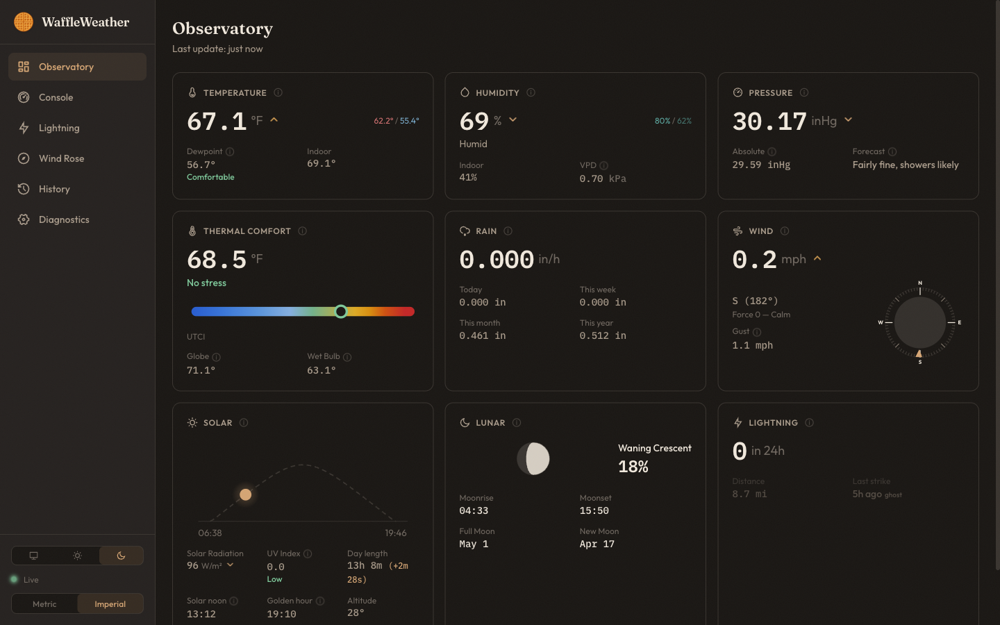</td>
    <td align="center">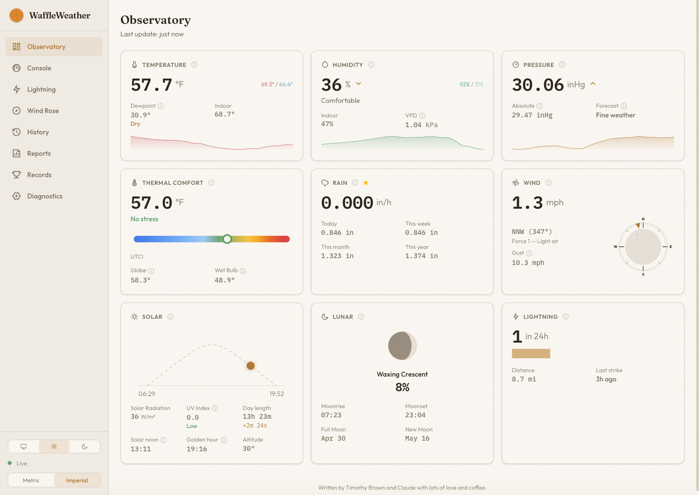</td>
  </tr>
  <tr>
    <td align="center">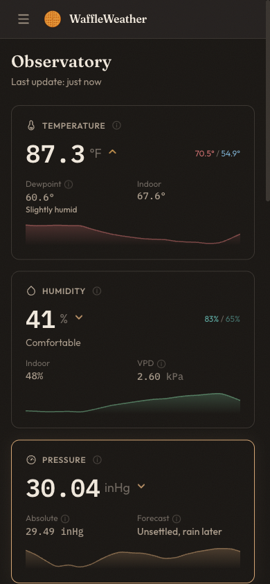</td>
    <td align="center">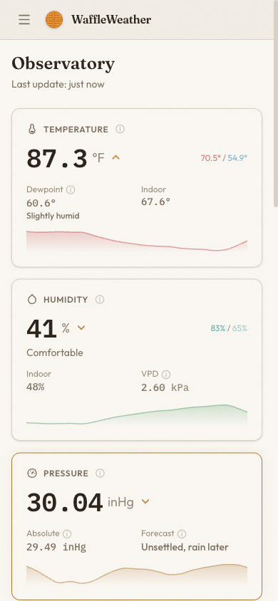</td>
  </tr>
</table>

## Why?

Ecowitt and other Fine Offset-based stations make solid, affordable weather station hardware. But the software options for viewing your data — vendor clouds, Weather Underground, WeeWX — all have tradeoffs. Cloud services mean your data lives on someone else's server. WeeWX is powerful but shows its age in the UI and lacks real-time updates out of the box.

WaffleWeather was built to fill that gap: a modern, good-looking dashboard that runs entirely on your local network, processes data in real time, and stores everything in a proper time-series database you control.

## Features

### Observatory

The main dashboard with 9 live-updating cards in a 3-column semantic grid. Temperature (daily high/low, dewpoint, indoor), humidity (indoor, VPD), pressure (Zambretti forecast), thermal comfort (UTCI with precise MRT from BGT sensor, Globe and Wet Bulb sub-stats when a black globe thermometer is connected), rain, wind (tick ring compass with canvas particle drift animation), solar (sun arc with irradiance-responsive glow, solar radiation, UV index, day length, golden hour, altitude), lunar (moon phase and illumination), and lightning. Every value updates in real time over WebSocket with 15-minute trend arrows. Click-to-toggle info tips on every card explain what each metric means and how it's calculated.

### Indoor Climate

Temperature and humidity from the gateway's built-in sensor, on two tabs. **Current** shows live values with 15-minute trend arrows and 24-hour sparklines. **History** charts both metrics across Day, Week, Month, and Year with the same pager and date pickers as the History page, and synced crosshairs between the two charts. Week and longer ranges plot temperature as max, average, and min (toggle each from the legend); Day plots the raw readings. The selected view, range, and date live in the URL (`?view=history&range=&date=`).

Readings are stored per sensor in their own table, with hourly, daily, and monthly rollups, so indoor history outlives the one-year raw-data retention window. Additional temperature/humidity sensors (such as WH31 channels) can be added later without a schema change.

<table align="center">
  <tr>
    <td align="center">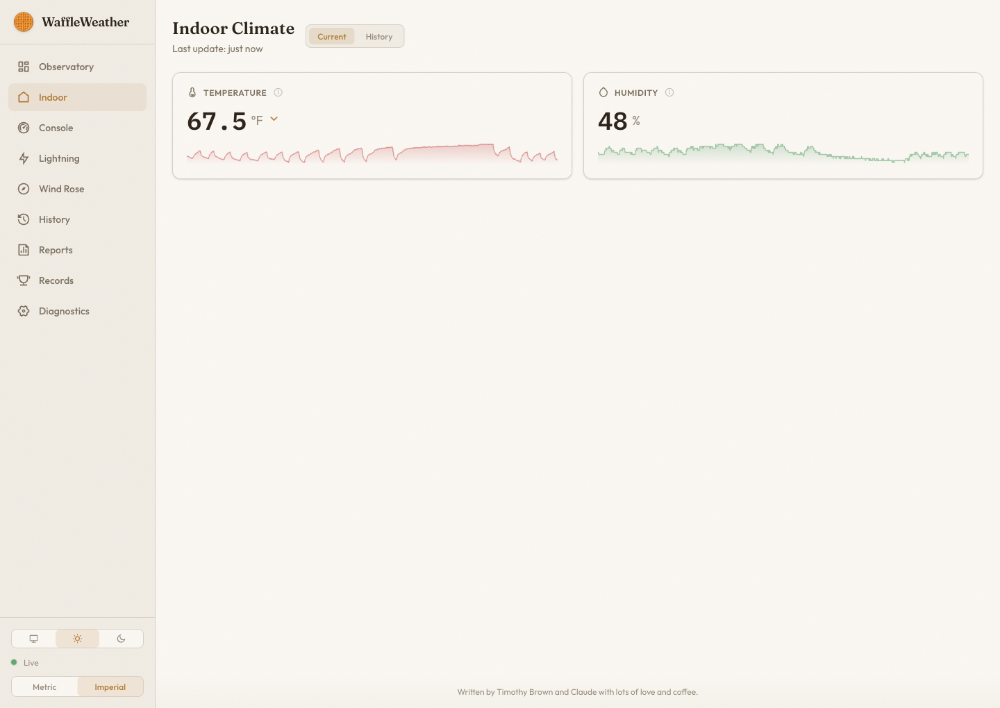</td>
    <td align="center">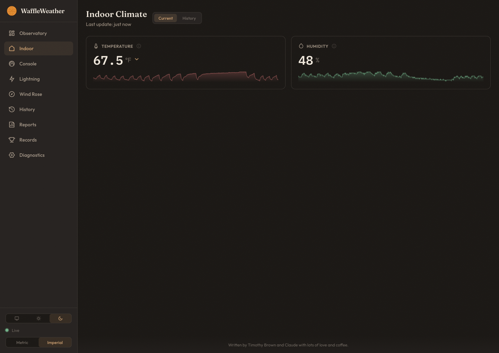</td>
  </tr>
  <tr>
    <td align="center">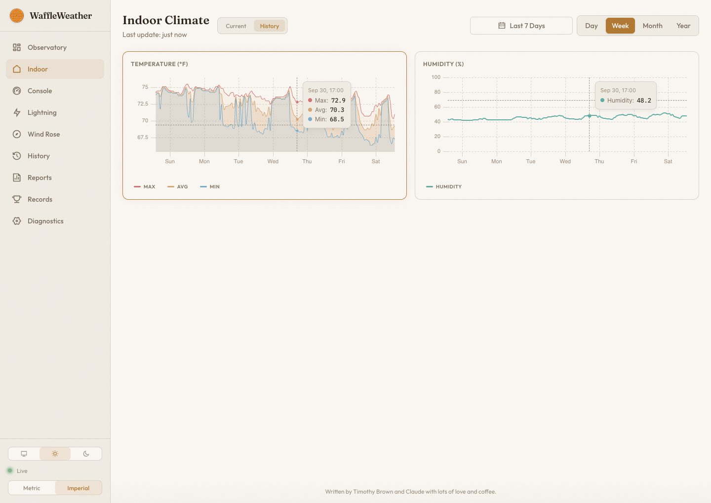</td>
    <td align="center">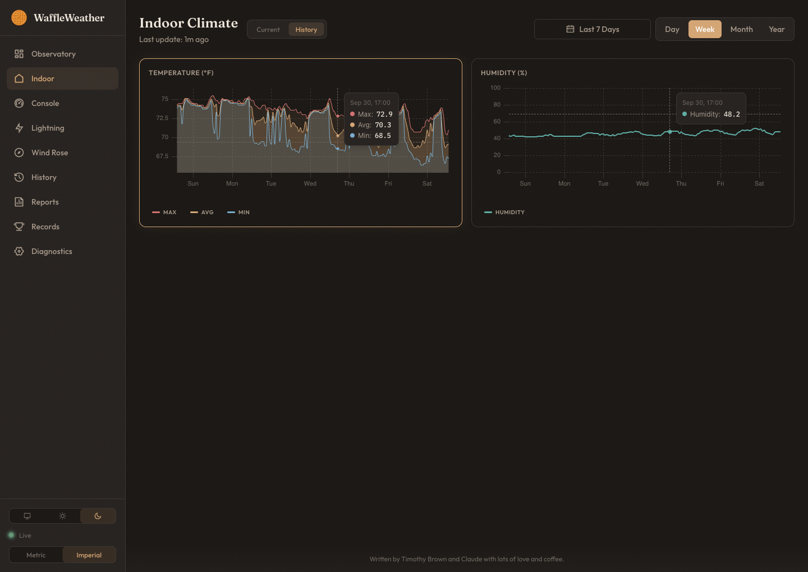</td>
  </tr>
</table>

### VFD Console

A Davis Vantage-inspired all-in-one display with an amber vacuum fluorescent aesthetic. Features a wind direction dot on a compass ring with speed centered inside, 24-hour barometric pressure dot chart, Zambretti forecast with large SVG weather icons, DSEG7 seven-segment numerics, Dotrice dot-matrix text, phosphor-glow effects, and a scrolling conditions ticker. Everything on one screen, no scrolling required.


### Lightning Tracker

Interactive Leaflet map showing your station location and strike distance rings. Below the map: current sensor stats (count, distance, time since last strike), a strike activity bar chart, and a storm distance line chart showing approach/retreat patterns. Detected events are stored in a separate hypertable so you can browse storm history in the timeline. A configurable ghost strike filter suppresses WH57 false positives — common single-strike events at fixed distances caused by EMI — flagging them rather than dropping them so raw data is preserved.


### Wind Rose

A custom SVG polar chart breaking down wind patterns by direction and speed across 16 compass sectors and 5 speed bands. Configurable time ranges from 24 hours to a full year, with statistics for dominant direction and peak gust.

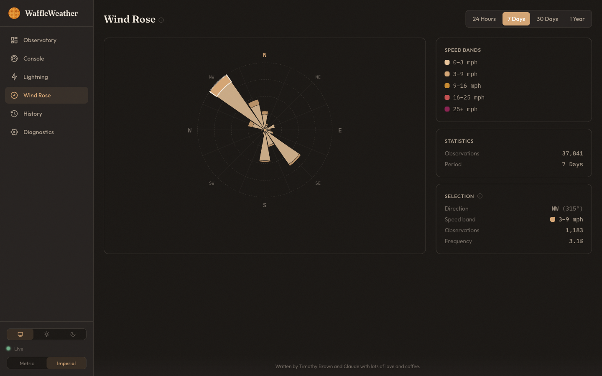

### History

Time-series charts for temperature, humidity, pressure, wind, rain, and solar/UV with automatic resolution scaling — raw data for 24 hours, hourly aggregates for a week, daily for a month, monthly for a year. Synchronized crosshairs across all charts and drag-to-zoom. Hover over any chart to see precise values in the floating tooltip. Click chart legend chips to toggle individual series.

Range buttons switch between Day, Week, Month, and Year views. The pager next to them scrubs through history: chevrons step the period backward or forward, while the calendar trigger opens a date picker that matches the current range — a month grid for Day picks, a row-highlighting calendar for Week picks, a 12-month grid for Month picks, and a 12-year paged grid for Year picks. Drill up from the day grid to a year list in two clicks. The selected period lives in the URL (`?range=&date=`) so any view is a shareable link.

The 24-hour Wind and Solar charts use adaptive bucketing — bucket size is chosen for pixel density and the chart renders as honest summary bars instead of plotting every raw sample. Drag-to-zoom past the raw cadence threshold falls back to raw lines.


### Calendar Heatmap

A GitHub-style calendar heatmap for daily temperature, humidity, rainfall, wind gust, solar radiation, or lightning. Switch between metrics using the tab bar. Hover over any day to see a detailed breakdown — temperature and humidity show daily low, average, and high; other metrics show the day's value with units.


### Climate Reports

NOAA-style monthly and yearly climate summaries with daily breakdown tables showing temperature, dewpoint, humidity, pressure, wind (with prevailing direction), rainfall, and heating/cooling degree days. Browse reports in the app with a year/month picker, or download classic fixed-width NOAA-format text files for archiving and sharing.

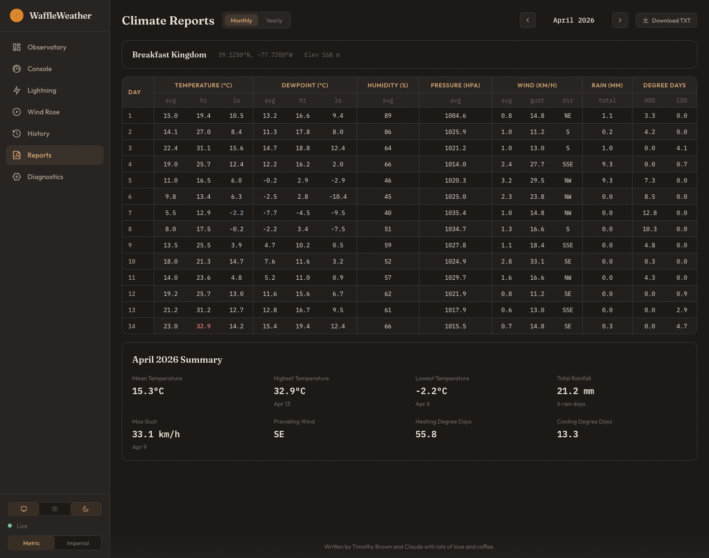

### Station Records

All-time, yearly, and monthly extremes across 6 categories: temperature, wind, rain, humidity, pressure, and solar. Each record shows the value and the date it was set. When an all-time record is broken today, a gold star badge appears on the corresponding Observatory card with a tooltip showing the previous record. Records are computed from continuous aggregates, so they stay fast even with years of data.

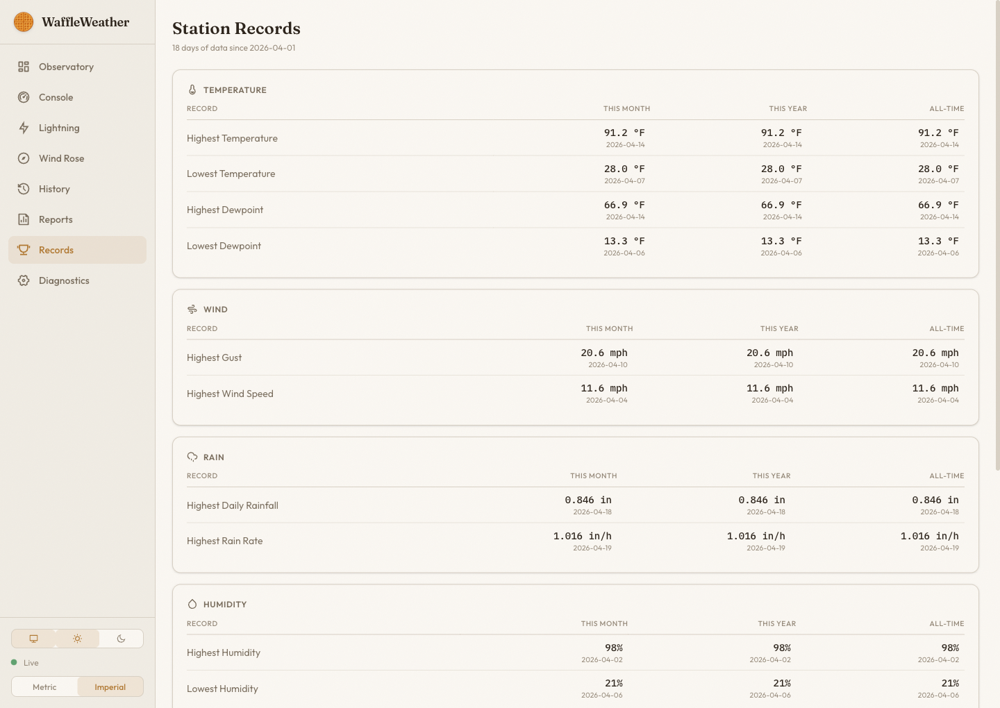

### Diagnostics

Battery levels, gateway stats, firmware info, and connection status. Useful for keeping an eye on sensor health.


### Install as an App

WaffleWeather is a Progressive Web App — add it to your phone's home screen for a native app experience. On iOS, tap Share → "Add to Home Screen". On Android, tap the install prompt in Chrome. You get standalone mode (no browser chrome), a waffle icon, and app shortcuts for quick access to the Observatory, Console, Lightning, and History pages. If the Pi is unreachable, an offline fallback page tells you so instead of a browser error.

### Additional Features

**Unit Toggle** — Global metric/imperial switch in the sidebar that converts everything on the fly. All data is stored as metric; conversions happen in the browser with precision tuned to sensor resolution.

**Derived Meteorology** — Dew point (Magnus-Tetens), heat index (full NWS Rothfusz), wind chill, composite feels-like, UTCI thermal comfort (precise MRT from Black Globe Temperature via ISO 7726 when available, otherwise approximated from solar radiation), and Zambretti barometric forecast (based on the [pywws implementation](https://github.com/jim-easterbrook/pywws) of the 1915 Negretti & Zambra algorithm, with 16-point wind direction table and automatic hemisphere detection from station latitude). Computed on the fly, never stored stale.

## Architecture

```
Weather Station  -->  ecowitt2mqtt  -->  Mosquitto (MQTT)
                                              |
                                         FastAPI Backend
                                        /       |       \
                                   REST API   WebSocket   TimescaleDB
                                        \       |       /
                                         Nginx reverse proxy
                                              |
                                       Next.js Frontend
```

Your weather station gateway pushes data to [ecowitt2mqtt](https://github.com/bachya/ecowitt2mqtt) over HTTP, which normalizes it and publishes to an MQTT broker. The FastAPI backend subscribes to MQTT, stores observations in TimescaleDB, enriches them with derived calculations, and pushes updates to connected browsers over WebSocket. The Next.js frontend handles all the rendering and unit conversions.

The native install runs everything directly on the Pi as systemd services, no containers required. A Raspberry Pi 4 with 4GB RAM handles it all comfortably. If you'd rather use containers, the same stack is available as a Docker Compose setup with prebuilt images (see [DOCKER.md](DOCKER.md)).

## Tech Stack

| Layer | Technology |
|-------|-----------|
| Backend | FastAPI, Python 3.12+, SQLAlchemy async, aiomqtt, Alembic |
| Database | TimescaleDB (PostgreSQL 17) — hypertables, continuous aggregates, compression |
| Frontend | Next.js 16 (App Router), TypeScript, uPlot (Canvas charts), TanStack Query |
| API Contract | OpenAPI 3.1 YAML (hand-written, single source of truth) |
| Client Codegen | Orval — generates typed TanStack Query hooks from the OpenAPI spec |
| Real-time | WebSocket with auto-reconnect and exponential backoff |
| Styling | Tailwind CSS v4, custom "Warm Observatory" design system |
| Fonts | Fraunces (headings), Outfit (body), IBM Plex Mono (data readouts) |
| Package Managers | uv (Python), pnpm (Node) |
| Deployment | systemd services behind an Nginx reverse proxy, or Docker Compose with images from GHCR |

## Hardware Requirements

**Weather Station**: Any Ecowitt or Fine Offset-based gateway with sensors — including Ambient Weather, Froggit, La Crosse, and other white-label brands. Data is normalized by [ecowitt2mqtt](https://github.com/bachya/ecowitt2mqtt), which supports Ecowitt, Ambient Weather, and Wunderground input formats. Currently tested with:

- **Gateway**: GW3000B (GW1000, GW1100, GW2000 should also work). Its built-in sensor supplies the indoor temperature and humidity.
- **Outdoor temperature/humidity**: WH32
- **Wind, solar, UV**: WS68
- **Rain gauge**: WH40H (piezo)
- **Black globe thermometer**: WN38 (Black Globe Temperature, WBGT)
- **Lightning**: WH57 (AS3935 sensor)

Sensors you don't have simply won't populate those cards — the dashboard gracefully handles missing data.

**Server**: Raspberry Pi 4 (4GB RAM recommended). Should also work on a Pi 5 or any Debian-based Linux system. The full stack (PostgreSQL + TimescaleDB, Mosquitto, FastAPI, Next.js, Nginx) runs well within 4GB.

## Setup

**Docker (recommended for homelab):** See [DOCKER.md](DOCKER.md) for Docker Compose setup — works on Unraid, Proxmox, Synology, or any Docker host. No weather station required if you use the [built-in simulator](tools/simulator/).

**Native Raspberry Pi:** This guide assumes you have a Raspberry Pi running 64-bit Raspberry Pi OS based on Debian 13 (Trixie), with SSH access and your weather station gateway on the same network. The setup script is written for that platform and hasn't been tested on other Debian releases.

### 1. Clone and run the setup script

```bash
ssh your-user@your-pi
git clone https://github.com/timothybrown/WaffleWeather.git /opt/waffleweather
cd /opt/waffleweather
bash deploy/setup.sh
```

The setup script installs and configures:
- PostgreSQL 17 + TimescaleDB (tuned for Pi 4)
- Mosquitto MQTT broker (with authentication)
- Nginx reverse proxy (with rate limiting)
- Node.js 24 + pnpm
- uv (Python package manager)
- ecowitt2mqtt, in its own virtualenv under `/opt/ecowitt2mqtt`
- `waffleweather` and `ecowitt2mqtt` system users, and systemd service files for the backend, frontend, and ecowitt2mqtt (installed but not started)

It generates random passwords for the database, MQTT broker, and API key, and writes them to `/opt/waffleweather/.env`. If Apache2 or WeeWX is running, the script stops and disables it.

### 2. Configure your environment

Edit `/opt/waffleweather/.env` with your station details:

```bash
# Station identity (shown in UI and used for lightning map centering)
WW_STATION_NAME=My Weather Station
WW_STATION_LATITUDE=40.7128
WW_STATION_LONGITUDE=-74.0060
WW_STATION_ALTITUDE=10.0
```

The database URL, MQTT credentials, and API key are filled in automatically by the setup script. See `.env.example` for the full list.

### 3. Configure ecowitt2mqtt

The setup script already installed [ecowitt2mqtt](https://github.com/bachya/ecowitt2mqtt) and its systemd unit (`deploy/ecowitt2mqtt.service`), which reads the MQTT credentials from the same `.env` file and listens on port 8080. Start it:

```bash
sudo systemctl enable --now ecowitt2mqtt
```

Then configure your gateway to push data to `http://your-pi:8080/data/report`. On Ecowitt gateways, this is the "Customized" server setting in the WSView or Ecowitt app. Other brands have similar custom server options — see your gateway's documentation.

**Important**: The setup script installs ecowitt2mqtt **2026.1.0**, and the Docker setup pins the same version. Don't upgrade it on your own for now. Its next release converts Black Globe and WBGT temperatures itself, and WaffleWeather currently does that conversion too, so upgrading early would convert those readings twice. A future WaffleWeather release will drop its own conversion and raise the version together. If a newer ecowitt2mqtt does get installed, pin it back with `sudo /opt/ecowitt2mqtt/venv/bin/pip install ecowitt2mqtt==2026.1.0`.

If you run ecowitt2mqtt some other way, pass `--disable-calculated-data` like the included unit does. WaffleWeather computes its own derived values (dew point, heat index, UTCI, etc.), and the pre-calculated ones from ecowitt2mqtt would conflict.

### 4. Deploy the application

On the Pi:

```bash
# Install backend dependencies, run migrations, backfill gateway sensors, materialize aggregates
cd /opt/waffleweather/backend
uv sync
uv run alembic upgrade head
uv run python -m app.maintenance.backfill_sensor_observations
uv run python -m app.maintenance.refresh_aggregates --family all

# Install frontend dependencies and build
# (postbuild step copies static assets into .next/standalone automatically)
cd /opt/waffleweather/frontend
pnpm install --frozen-lockfile
pnpm build

# Set ownership and start services
sudo chown -R waffleweather:waffleweather /opt/waffleweather
sudo systemctl enable --now waffleweather-backend waffleweather-frontend
```

The refresh step materializes historical continuous-aggregate buckets. It runs separately from migrations because TimescaleDB forbids `refresh_continuous_aggregate` inside a transaction block. It is idempotent and safe to re-run.

The dashboard should now be accessible at `http://your-pi` on port 80. For HTTPS (required for PWA service worker and install prompts), see the Tailscale TLS section in [DEVELOPMENT.md](DEVELOPMENT.md).

### 5. Verify data flow

Once your gateway is pushing data to ecowitt2mqtt, you should see data appear on the Observatory dashboard within a few seconds. Check the Diagnostics page to confirm the WebSocket connection is active and sensor batteries are reporting.

## Sensor Compatibility

WaffleWeather's MQTT parser maps field names from ecowitt2mqtt to database columns. Since ecowitt2mqtt normalizes data across all Fine Offset brands, the same field names work regardless of your hardware brand. It handles multiple naming conventions across sensor models:

| Data | Sensor Keys (any of these) |
|------|---------------------------|
| Outdoor temp/humidity | `temp`, `tempf`, `temperature`, `humidity` |
| Wind | `windspeed`, `windgust`, `winddir` |
| Rain | `dailyrain`, `dailyrainin`, `drain_piezo` (+ weekly, monthly, yearly, event, rate) |
| Pressure | `baromrel`, `baromrelin`, `baromabs` |
| Solar/UV | `solarradiation`, `uv` |
| Lightning | `lightning`, `lightning_time`, `lightning_num` |
| Indoor temp/humidity | `tempin`, `tempinf`, `humidityin` |
| Black Globe / WBGT / VPD | `bgt`, `wbgt`, `vpd` |

If your sensor setup uses different field names, check `backend/app/mqtt/parser.py` — the mapping is straightforward to extend.

Cards for sensors you don't have (e.g., lightning if you only have a WH32) will simply not render or will show "No data."

> **Upgrade note (2026.8.17.1):** `temp1` and `humidity1` no longer map to outdoor temperature and humidity. These are WH31 multi-channel sensor keys, and treating channel 1 as the primary outdoor reading meant that pairing a WH31 on that channel would silently overwrite outdoor temperature, daily extremes, and Records. Stations reporting `temp`, `tempf`, or `temperature` — which is nearly all of them — are unaffected. If your station reports **only** `temp1`, outdoor temperature will stop populating until per-channel sensor ingestion ships.

## Database

TimescaleDB powers the storage layer with three hypertables:

- **`weather_observations`** — one row per station per observation interval (~16s default), chunked by day
- **`sensor_observations`** — temperature/humidity readings from auxiliary sensors, one row per sensor per interval, keyed by `sensor_key` (`gw` is the gateway's built-in indoor sensor), chunked by day
- **`lightning_events`** — detected strike events with delta counts and distance, chunked by week

A small **`sensors`** table holds each auxiliary sensor's label and placement. New sensors register themselves on their first reading.

Each observation hypertable has three continuous aggregates (hourly, daily, monthly) that roll up key metrics hierarchically. On both, compression kicks in after 14 days and raw rows are dropped after 1 year; the aggregates keep long-term history after that.

All derived values (dew point, heat index, wind chill, feels like, UTCI, Zambretti) are computed at query time, not stored. This keeps the schema clean and makes it easy to refine calculations without backfilling.

## Documentation

- **[DEVELOPMENT.md](DEVELOPMENT.md)** — Local setup, testing, environment variables, project structure, and deployment
- **[DOCKER.md](DOCKER.md)** — Docker Compose setup, configuration, upgrades, backups, and using an existing MQTT broker
- **[API.md](API.md)** — REST endpoints, WebSocket protocol, database schema, and frontend data flow

## Security Notes

WaffleWeather is designed for local network use. The setup script ships sensible defaults:

- **Rate limiting**: Nginx `limit_req_zone` at 30 r/s for `/api/` and 5 r/s for `/ws/` (installed to `/etc/nginx/conf.d/zz-waffleweather-ratelimit.conf`)
- **Security headers**: CSP, X-Frame-Options, X-Content-Type-Options, Referrer-Policy, and Permissions-Policy on all responses; HSTS additionally on HTTPS responses
- **API key authentication**: Nginx injects an `X-API-Key` header from a snippet the setup script generates. When `WW_API_KEY` is set in `.env`, the backend validates it; when unset, auth is disabled (suitable for LAN-only use)

For internet-facing deployments, additionally:

- **HTTPS**: Uncomment Block 2 in `deploy/nginx.conf` and supply a cert. If you use [Tailscale](https://tailscale.com/), `tailscale cert` provides free automatic certificates for your `.ts.net` domain — see [DEVELOPMENT.md](DEVELOPMENT.md) for setup. Let's Encrypt works well for public-facing setups
- **CORS**: The backend allows only `GET` and `OPTIONS` requests from the origins listed in `WW_CORS_ORIGINS` (default `http://localhost`). Behind Nginx the dashboard and API share an origin, so only add origins you actually call the API from

## Credits

Built by Timothy Brown and [Claude](https://claude.ai) with lots of love and coffee.

## License

This project is provided as-is for personal and educational use. See [LICENSE](LICENSE) for details.
